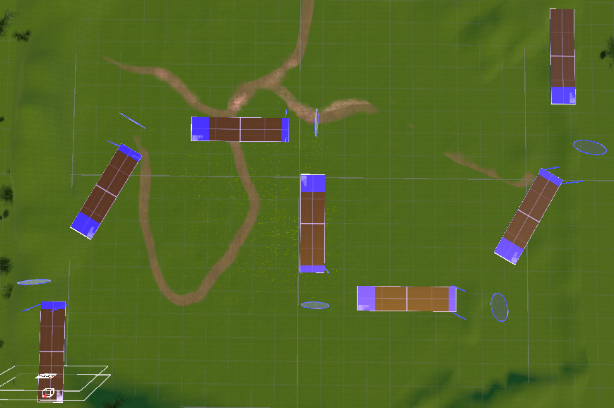
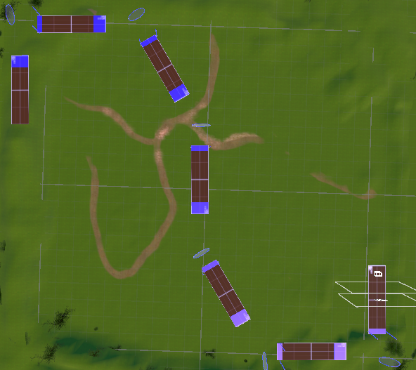
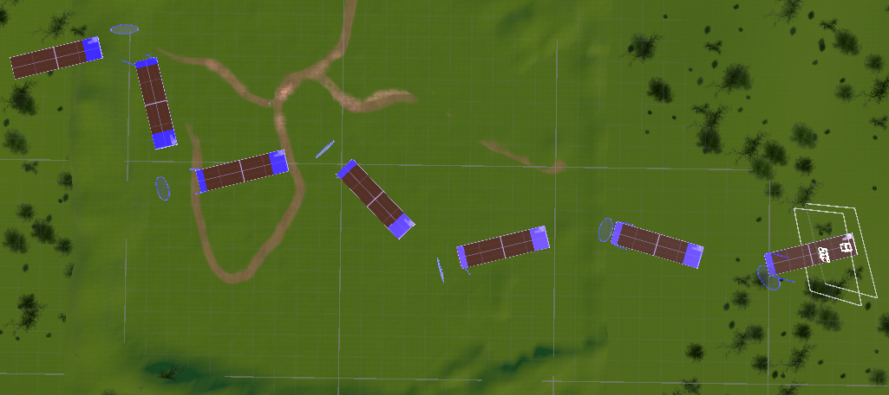
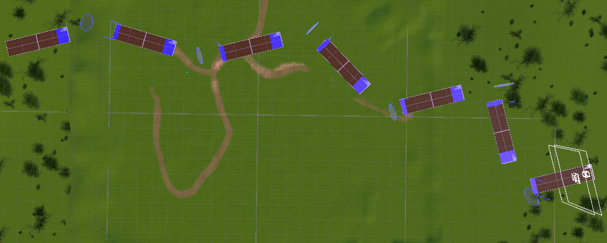

# AirStrafeJump

オープンキャンパス展示用VRアスレチックゲーム

大学のオープンキャンパスで、研究で扱うVR Locomotion（仮想空間内の移動操作）を来場者に体験してもらうために制作しました。足場を移動し、道中のトラップを避けてゴールを目指します。練習から再挑戦、結果表示までをゲームとして構成しています。実際に、２日間オープンキャンパスにて来場者向けに展示・運用し合計40名程度のかたに体験していただきました。

- [コース全景を見る](#コース全景)
- [デモ動画を見る](https://youtu.be/1InyBULcS34)

## 概要

研究に関連する移動操作を、来場者が遊びながら体験できる形にした作品です。VR未経験者の利用も想定し、練習用チュートリアルと4つの本編コースを用意しています。

本READMEは画像・動画とともに作品を紹介する資料です。ソースコードやUnityプロジェクトの配布を前提としていません。未発表研究の詳細は非公開です。

## 制作情報

| 項目 | 内容 |
| --- | --- |
| 開発形態 | 個人開発 |
| 使用技術 | Unity / C# / SteamVR / OpenVR / Unity UI / TextMesh Pro |
| Unityバージョン | 2022.3.62f2 |
| VR環境 | VIVE HMD / VIVE Controller / VIVE Tracker |
| 使用機会 | 大学オープンキャンパスでの研究室紹介、体験 |

## ゲームの流れ

**チュートリアル → ゲーム本編 → ゴール・結果表示**

チュートリアルで基本操作を練習した後、本編のコースに挑戦します。本編では進行ガイドを頼りに足場を移動し、失敗した場合は復帰して再挑戦できます。ゴール後はクリアタイムとランキングを表示します。

## 操作方式

同じゲーム内で、次の4種類の入力方式を扱います。

| 方式 | 利用する情報 |
| --- | --- |
| Controller | コントローラーを基準とした入力 |
| HMD（ヘッドセット） | 頭部の向きを基準とした入力 |
| Waist Tracker | 腰に装着したTrackerの動き |
| Arm Tracker | 腕に装着したTrackerの回転 |

入力の詳細な計算方法やパラメータ、アルゴリズムは掲載していません。

## デモ動画

画像をクリックすると、YouTubeでデモ動画を再生できます。

[デモ動画を見る](https://youtu.be/1InyBULcS34)

## コース全景

本編で使用する4つのコースの全景です。

### Course A

### Course B

### Course C

### Course D

## 工夫した点

### 1. 本編の前に段階式の練習を用意

VR未経験の来場者に、一度にすべての操作を求めない構成としました。専用のチュートリアルで練習内容を段階的に提示し、進捗と完了を画面内に表示します。

### 2. 失敗しても途中から再挑戦できる構成

落下によって体験が途切れないよう、進行に応じて復帰地点を更新します。復帰時には現在の進行ガイドも再設定し、同じ区間に再挑戦できるようにしています。

### 3. 視覚と音で次の目標・成功を伝える

コース内で次に向かう場所と進行状況を伝えるため、目標地点のガイドやリングの表示状態を更新します。リング通過・着地成功などには音を加え、成功を視覚と音の両方で知らせます。

### 4. 共通のゲーム体験で複数の入力方式を扱う

Controller・HMD・腰や腕のTrackerを使う4方式を、同じゲーム内で体験できる構成にしました。入力方式ごとのコンポーネントを切り替える管理処理を設け、体験開始時の操作有効化もまとめて扱っています。

## 主な実装機能

- 段階式チュートリアル・コース進行ガイド
- 開始カウントダウン・タイム計測・制限時間管理
- リトライ／復帰
- 結果表示・クリアタイムランキング
- サウンドフィードバック

## 技術・設計面

コース進行、時間管理、復帰、結果表示を別のコンポーネントに分け、4つの本編シーンで共通の実装を利用しています。たとえば、コース終了処理がタイマーを停止し、記録の保存と結果表示につなげる構造です。入力方式の切り替えは、これらとは別の管理コンポーネントで扱います。

## 研究内容について

本作品は、大学院での研究に関連する技術を一部利用しています。未発表研究のため、研究目的、実験条件、評価内容、詳細な入力処理、パラメータ、アルゴリズムは非公開です。
